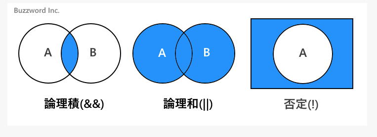

# Java トレーニング中メモ

## import 文

### import 文の使い方

- 例) java 標準パッケージ import

```java
import java.time.LocalDate;

class JSample9_1{
  public static void main(String[] args){
    LocalDate ld = LocalDate.now();
    System.out.println(ld);
  }
}
```

- 例) カスタマイズ import

```java
/** ./src/lessons/Persol.java */
package lessons;

public class Persol {
  public void hello() {
    System.out.println("おはよう");
  }
}

/** ./src/App.java */
import lessons.Persol;

public class App {
  public static void main(String[] args) {
    Persol persol = new Persol();
    persol.hello();
    System.out.println("Hello");
  }
}

```

### エンコードファイル

- java エンコードファイル一覧

| java.nio API | java.io/java.lang |                                                    |
| ------------ | ----------------- | -------------------------------------------------- |
| US-ASCII     | ASCII             | American Standard Code for Information Interchange |
| UTF-8        | UTF8              | Eight-bit Unicode (or UCS) Transformation Format   |
| EUC-JP       | ECU_JP            | JISX 0201, 0208 and 0212, EUC encoding Japanese    |
| Shift_JIS    | SJIS              | Shift-JIS, Japanese                                |
| windows-31j  | MS932             | Windows Japanese                                   |

### エスケープシーケンス

- java エスケープシーケンス一覧

| char   | description                   |
| ------ | ----------------------------- |
| \b     | バックスペース                |
| \t     | 水平タブ                      |
| \n     | 改行                          |
| \r     | 復帰                          |
| \f     | 改ページ                      |
| \'     | シングルクオーテーション      |
| \"     | ダブルクオーテーション        |
| \\     | \文字                         |
| \ooo   | 8 進数の文字コードが表す文字  |
| \uhhhh | 16 進数の文字コードが表す文字 |

### データ型

| データ型 | 値                                                                    |
| -------- | --------------------------------------------------------------------- |
| boolean  | true or false                                                         |
| char     | 16 ビット Unicode 文字 \u0000 ～\uFFFF                                |
| byte     | 8 ビット整数 -128 ～ 127                                              |
| short    | 16 ビット整数 -32,768 ～ 32,767                                       |
| int      | 32 ビット整数 -2,147,483,648 ～ 2,147,483,647                         |
| long     | 64 ビット整数 -9,223,372,036,854,775,808 ～ 9,223,372,036,854,775,807 |
| float    | 32 ビット単精度浮動小数点数                                           |
| double   | 64 ビット倍精度浮動小数点数                                           |

### 変更可能な型変換(拡大変換)

| 変更元 | 変更先                      |
| ------ | --------------------------- |
| byte   | short,int,long,float,double |
| short  | int,long.float,double       |
| int    | long,float,double           |
| long   | float,double                |
| float  | double                      |
| double | not found                   |
| char   | int,long,float,double       |

- 扱える範囲の大きさ順は `double > float > long > int > short > bye`である

### 変更可能な型変換(縮小変換)

| 変更元 | 変更先                         |
| ------ | ------------------------------ |
| byte   | char                           |
| short  | char,byte                      |
| int    | char,byte,short                |
| long   | char,byte,short,int            |
| float  | char,byte,short,int,long       |
| double | char,byte,short,int,long,float |
| char   | byte,short                     |

### 演算時の型変換ルール

1. (1) どちらかの値が double 型の場合は他の値を double 型に変換する
2. (2) どちらかの値が float 型の場合は他の値を float 型に変換する
3. (3) どちらかの値が long 型の場合は他の値を long 型に変換する
4. (4) (1)から(3)に該当しない場合は両方の値を int 型に変換する

### ラッパークラス

| 基本データ型 | ラッパークラス |
| ------------ | -------------- |
| boolean      | Boolean        |
| char         | Character      |
| byte         | Byte           |
| short        | Short          |
| int          | Integer        |
| long         | Long           |
| float        | Float          |
| double       | Double         |

### 演算子優先度

| 結合規則 | 演算子                            |
| -------- | --------------------------------- | ---- | --- |
| 左       | (引数) [配列添字] . ++ --(後置き) |
| 右       | ! ~ + -(単項演算子) ++ --(前置き) |
| 左       | new (型変換)                      |
| 左       | \* / %                            |
| 左       | + -(算術演算子)                   |
| 左       | << >> >>>                         |
| 左       | > >= < <= instanceof              |
| 左       | == !=                             |
| 左       | &                                 |
| 左       | ^                                 |
| 左       |                                   |      |
| 左       | &&                                |
| 左       |                                   |      |     |
| 右       | ?:                                |
| 左       | = += -= \*= /= %= <<= >>= >>>= &= | = ^= |

### 代入演算子

| 演算子 | 使用例   | 意味               |
| ------ | -------- | ------------------ |
| +=     | A += B   | A = A + B と同じ   |
| -=     | A -= B   | A = A - B と同じ   |
| \*=    | A \*= B  | A = A \* B と同じ  |
| /=     | A /= B   | A = A / B と同じ   |
| %=     | A %= B   | A = A % B と同じ   |
| &=     | A &= B   | A = A & B と同じ   |
| ^=     | A ^= B   | A = A ^ B と同じ   |
| <<=    | A <<= B  | A = A << B と同じ  |
| >>>=   | A >>>= B | A = A >>> B と同じ |

- `!=` A |= B A = A|B と同じ

### 関係演算子・等価演算子

| 演算子 | 使用例 | 意味                      |
| ------ | ------ | ------------------------- |
| <      | A<B    | A は B より小さい         |
| <=     | A<=B   | A は B より小さいか等しい |
| >      | A>B    | A は B より大きい         |
| >=     | A>=B   | A は B より大きいか等しい |
| ==     | A==B   | A と B は等しい           |
| !=     | A!=B   | A と B は等しくない       |

### 論理演算子

| 演算子 | 使用例 | 意味 |
| && | A && B | 論理積、A と B が共に true なら true |
| ! | !A | 否定 A が true なら false, A が false なら true |

- `A || B` 論理和、 A か B の少なくとも 1 つが true なら true



### 三項演算子

- `Interger test = exmple >=3 ? 4 : 0;`

### Java 21 標準パッケージ

1. java.lang - 基本的なクラス（String, Math, System など）
2. java.util - ユーティリティクラス（コレクションフレームワーク、日付・時間など）
3. java.io - 入出力操作（ファイル、ストリームなど）
4. java.nio - 新しい I/O（非ブロッキング I/O、バッファなど）
5. java.net - ネットワーク機能（ソケット、URL など）
6. java.awt - グラフィックス、ユーザーインターフェース（GUI）関連
7. javax.swing - スイング（GUI コンポーネント）
8. java.sql - JDBC（データベース接続）
9. java.security - セキュリティ関連の機能
10. java.util.concurrent - 同時実行処理（スレッド、ロックなど）
11. java.time - 日付・時間 API
12. java.util.function - 関数型インターフェース
13. java.util.stream - ストリーム API
14. java.lang.annotation - アノテーション関連のクラス
15. java.lang.invoke - 動的メソッド呼び出し
16. java.lang.ref - 参照クラス（弱参照、ソフト参照など）
17. java.util.spi - サービスプロバイダインターフェース
18. [JDK21 Documentation](https://docs.oracle.com/en/java/javase/21/)
19. [JDK21 API Documentation](https://docs.oracle.com/en/java/javase/21/docs/api/index.html)
